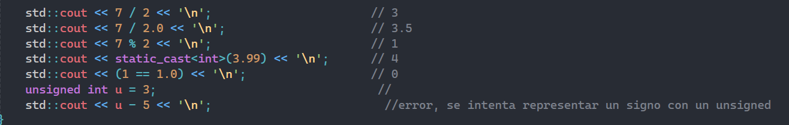

En esta actividad se ve sobretodo los tipos de datos, los limites en tamano y funcionamiento,
viendo como el no tener signo puede llevar a resultados diferentes por como se guarda la informacion
[1111]+1=1[0000];

